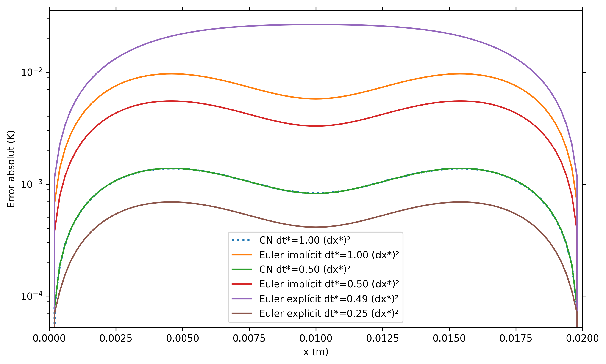

# Comparació d'errors entre mètodes numèrics

El programa **errors** compara les solucions obtingudes a partir de tres mètodes numèrics diferents —**Crank–Nicolson**, **Euler explícit** i **Euler implícit** (organitzats en tres carpetes)— emprant diversos valors de `Δt`.  
Aquestes solucions es comparen amb la solució analítica de l’equació diferencial per analitzar-ne la precisió.

## Resultats

La següent imatge mostra l’error comès per cada mètode en funció de `Δt`:

A partir dels resultats, veiem que el millor mètode és **Euler explícit** (carpeta `euler_explicit`) quan s’utilitza un pas temporal de:

\[
\Delta t = 0.25 (\Delta x)^2
\]

Per tant, el problema plantejat s’ha resolt utilitzant aquest cas òptim (vegeu la carpeta `euler_explicit`).

> **Nota:** El problema també s’ha resolt amb el mètode de **Crank–Nicolson**.
